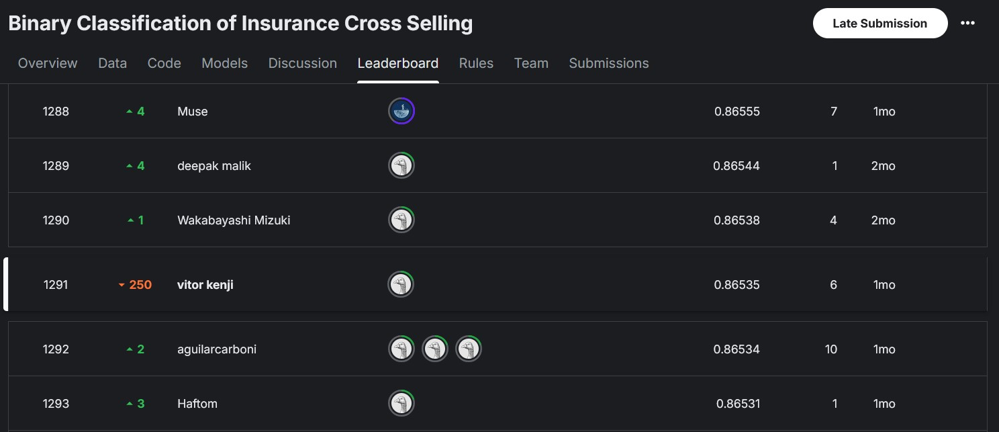

# Solving Kaggle competition: [Binary Classification of Insurance Cross Selling](https://www.kaggle.com/competitions/playground-series-s4e7) 

## Overview

The objective is to create a model to predict which customers respond positively to an automobile insurance offer.

## Final Results

In the end i achieved rank 1291 of 2236. 

